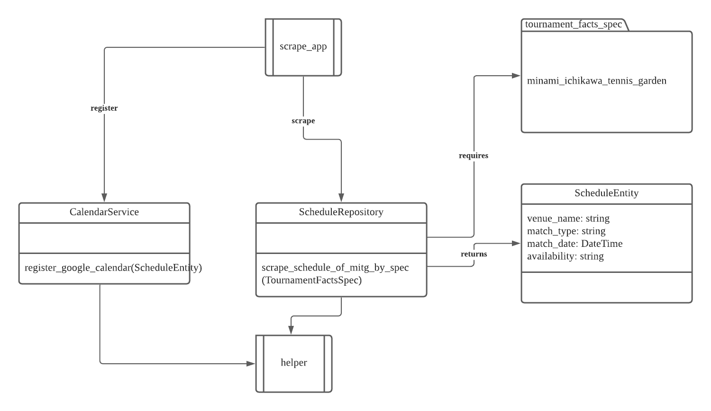

## Why is this app important ?

I participate in a tennis tournament and this app helps me to acknowledge the date of the tournament on calendar service.

## What does it do ?

Scrape (_scrape_app_) tournament schedules (_schedule entity_) from various tennis venues (_tournament_facts_spec_).
Schedules then registered (_calendar_service_) to external calendar (e.g google calendar).

## How does it work ?
### Layered architecture

```
Application Layer : scrape_app
------------------------------------------------------------------------------------------
Domain Layer: tournament_facts_spec as value_obj, schedule as entity & repository
------------------------------------------------------------------------------------------
Infrastructure Layer: calendar as service
```

## UML

